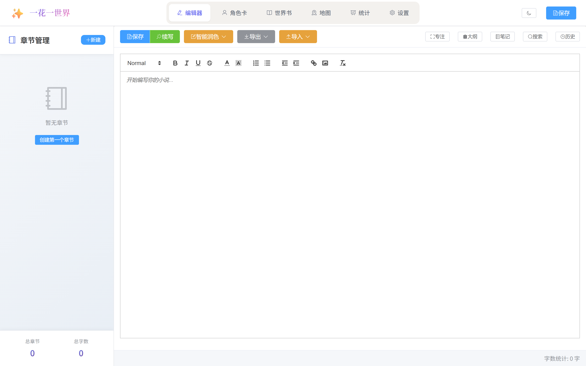
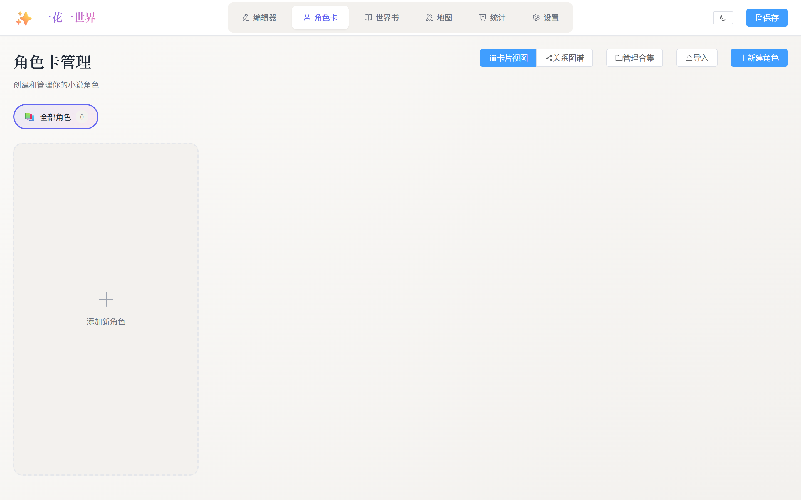
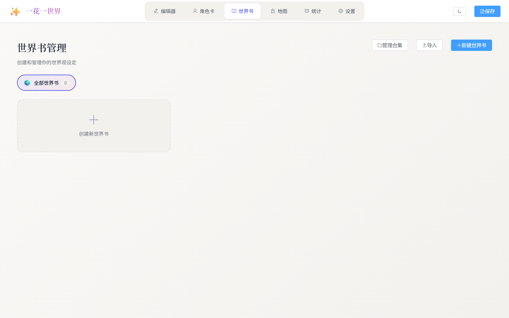
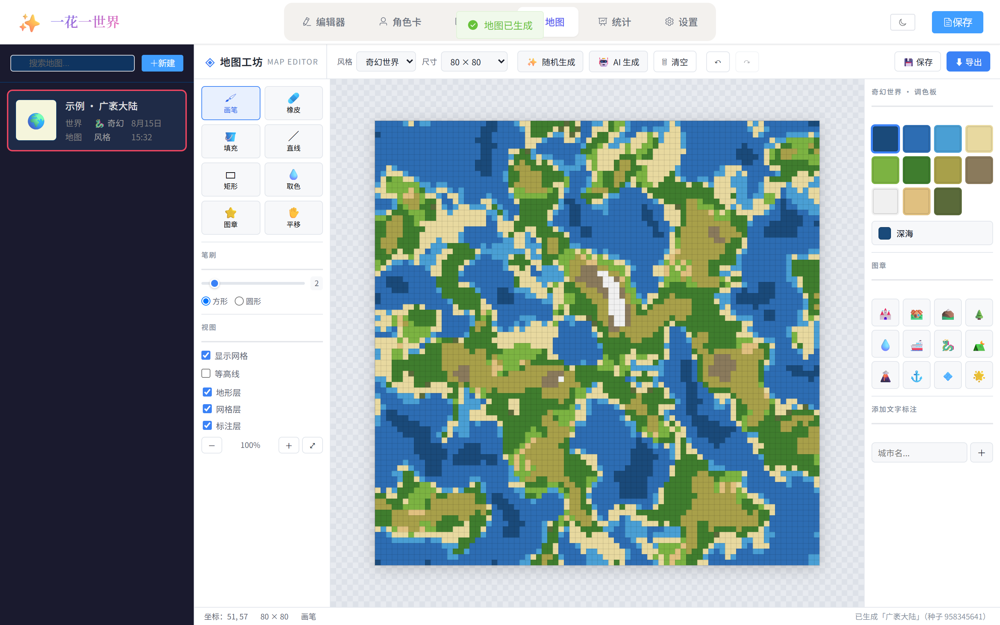
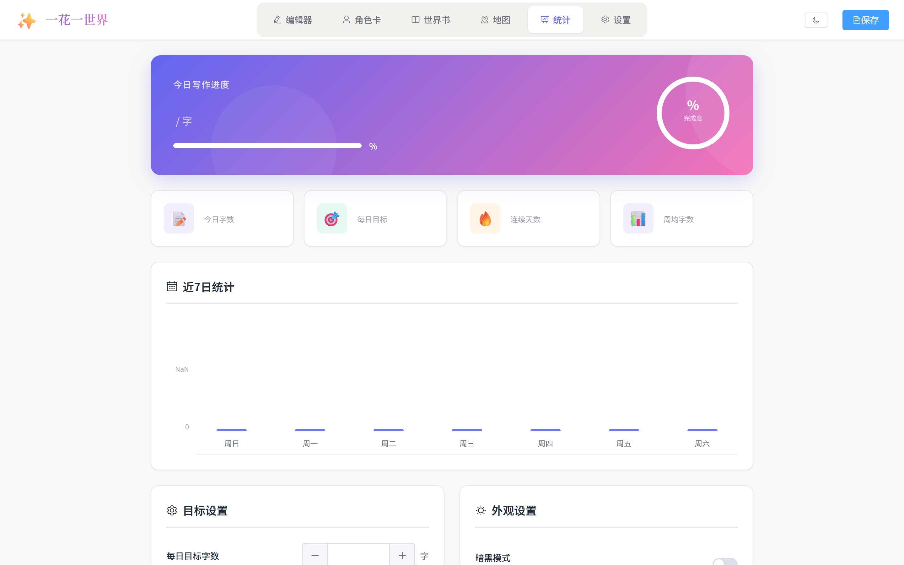
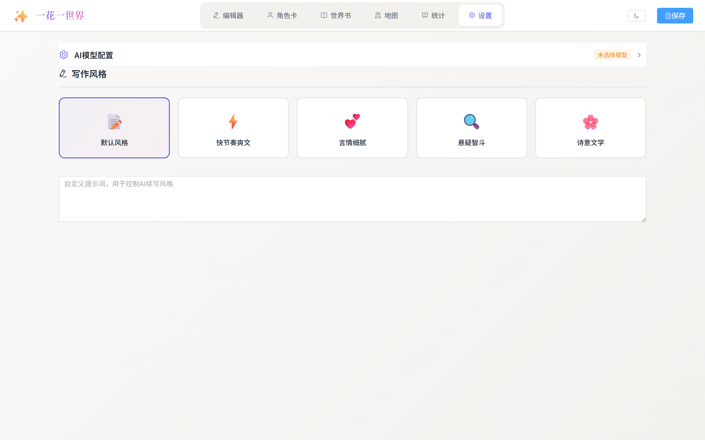

# ✨ 一花一世界

**让 AI 成为你的写作搭档，把脑中的世界一字一句写出来。**

基于 Vue 3 + TypeScript 的智能小说创作工具，集**多模型 AI 续写**、**角色卡**、**世界书**、**像素瓦片地图编辑器**、**写作统计** 于一体。


[**🚀 快速开始**](#-快速开始) · [**📸 功能预览**](#-功能预览) · [**🧩 技术栈**](#-技术栈) · [**🤖 AI 模型**](#-支持的-ai-模型) · [**🗺️ 开发计划**](#-开发计划)

---

## 📸 功能预览


| | |
|:---:|:---:|
|  |  |
| **✍️ 智能编辑器** · Quill 富文本 + AI 续写 | **🎭 角色卡** · 性格 / 外貌 / 关系图谱 |
|  |  |
| **📚 世界书** · 关键词触发的设定注入 | **🗺️ 像素瓦片地图** · 三层 Canvas · 7 种地形预设 |
|  |  |
| **📊 写作统计** · 日 / 周目标 · 连续天数 | **⚙️ 设置** · 多模型 · 5 种写作风格 |

---

## 🎯 项目特色

- 🧠 **多模型 AI 续写** — GLM / DeepSeek / OpenAI / Claude / Grok / 自定义 API，按需切换
- 🎭 **角色卡与世界书** — 像 SillyTavern 一样为故事注入人物性格和世界规则
- 🗺️ **像素瓦片地图编辑器** — Perlin 噪声生成、画笔 / 橡皮 / 填充 / 图章，AI 一句话出地图
- 📊 **写作统计与专注模式** — 字数趋势、每日目标、连续天数、暗黑模式
- 💾 **本地优先** — 所有数据存放在浏览器 IndexedDB，无需后端，隐私可控
- 🌗 **亮 / 暗主题** — 一键切换，护眼友好

---

## 📑 目录

- [✨ 一花一世界](#-一花一世界)
  - [📸 功能预览](#-功能预览)
  - [🎯 项目特色](#-项目特色)
  - [📑 目录](#-目录)
  - [🚀 快速开始](#-快速开始)
    - [环境要求](#环境要求)
    - [安装与运行](#安装与运行)
    - [其他脚本](#其他脚本)
  - [🧩 技术栈](#-技术栈)
  - [📂 项目结构](#-项目结构)
  - [🤖 支持的 AI 模型](#-支持的-ai-模型)
    - [内置提供商](#内置提供商)
    - [自定义 API](#自定义-api)
  - [📖 使用指南](#-使用指南)
    - [1. 配置 AI 模型](#1-配置-ai-模型)
    - [2. 创建角色卡](#2-创建角色卡)
    - [3. 创建世界书](#3-创建世界书)
    - [4. 地图编辑](#4-地图编辑)
    - [5. 章节管理](#5-章节管理)
    - [6. 选择写作风格](#6-选择写作风格)
    - [7. 开始续写](#7-开始续写)
    - [8. 导入 / 导出](#8-导入--导出)
  - [⚙️ 配置说明](#️-配置说明)
    - [API 密钥](#api-密钥)
    - [温度参数（0 – 2）](#温度参数0--2)
    - [世界书扫描](#世界书扫描)
    - [角色卡注入示例](#角色卡注入示例)
  - [💽 数据存储](#-数据存储)
  - [🗺️ 开发计划](#️-开发计划)
    - [✅ 已完成](#-已完成)
    - [🚧 进行中 / 计划中](#-进行中--计划中)
  - [📄 License](#-license)

---

## 🚀 快速开始

### 环境要求

- Node.js **18+**
- npm / yarn / pnpm 任一

### 安装与运行

```bash
# 克隆仓库
git clone https://github.com/sleepykino/One-flower.git
cd oneflower

# 安装依赖
npm install

# 启动开发服务器（默认 http://localhost:5173/）
npm run dev

# 构建生产版本
npm run build

# 预览生产版本
npm run preview
```

> 首次启动后，建议先到 **设置 → AI 模型配置** 填入至少一个 API Key。

### 其他脚本

| 命令 | 说明 |
| --- | --- |
| `npm run dev` | 启动 Vite 开发服务器 |
| `npm run build` | 类型检查 + 生产构建 |
| `npm run preview` | 本地预览构建产物 |
| `npm run lint` | ESLint 自动修复 |
| `npm run type-check` | TypeScript 类型检查 |

---

## 🧩 技术栈

| 类别 | 技术 |
| --- | --- |
| **框架** | Vue 3（Composition API）+ Vue Router |
| **语言** | TypeScript |
| **UI 组件** | Element Plus + @element-plus/icons-vue |
| **富文本** | Quill |
| **状态管理** | Pinia |
| **本地存储** | IndexedDB（Dexie.js） |
| **HTTP** | Axios |
| **打包 / 压缩** | Vite + JSZip |
| **代码规范** | ESLint + Prettier |

---

## 📂 项目结构


```
src/
├── components/                # Vue 组件
│   ├── ChapterList.vue        #   章节列表（树形结构）
│   ├── CharacterCard.vue      #   角色卡管理
│   ├── Editor.vue             #   Quill 富文本编辑器
│   ├── Sidebar.vue            #   侧边栏
│   ├── WorldBook.vue          #   世界书管理
│   ├── APIConfig.vue          #   AI 模型配置
│   ├── RelationshipGraph.vue  #   角色关系图谱
│   └── map/                   #   地图编辑模块
│       ├── MapList.vue          #     地图列表
│       ├── MapEditor.vue        #     地图编辑器（三栏布局）
│       ├── MapCanvas.vue        #     三层 Canvas 瓦片渲染
│       ├── MapToolbar.vue       #     顶栏（风格 / 尺寸 / 生成 / 撤销）
│       ├── TerrainPanel.vue     #     地形调色板 / 图章 / 文字面板
│       ├── MapInfoPanel.vue     #     地图信息面板
│       ├── GenerateDialog.vue   #     随机地形生成对话框
│       └── AIGenerateDialog.vue #     AI 地图生成对话框
├── database/                  # 数据层
│   ├── db.ts                  #   Dexie 数据库定义
│   ├── index.ts               #   数据库导出
│   └── migration.ts           #   localStorage → IndexedDB 迁移
├── services/                  # 服务层
│   └── aiService.ts           #   AI 调用、上下文注入
├── stores/                    # Pinia 状态管理
│   ├── chapter.ts · character.ts · worldBook.ts
│   ├── settings.ts · collection.ts · aiProvider.ts
│   ├── map.ts · writingStats.ts
├── types/                     # 类型定义
│   ├── map.ts · jszip.d.ts
├── utils/                     # 工具函数
│   ├── exportImport.ts        #   导入导出工具
│   └── mapGenerator.ts        #   地图生成（Perlin 噪声、地形预设、地牢）
├── composables/               # 组合式函数
├── App.vue                    # 根组件（含六大模块导航）
└── main.ts                    # 入口文件
```

---

## 🤖 支持的 AI 模型

### 内置提供商

| 提供商 | 模型 |
| --- | --- |
| 🇨🇳 **智谱 GLM** | GLM-5.2 · GLM-5.3 |
| 🇨🇳 **DeepSeek** | DeepSeek-v4-flash · DeepSeek-v4-pro |
| 🇺🇸 **OpenAI** | GPT-5.6 Sol（旗舰）· GPT-5.6 Terra（均衡）· GPT-5.6 Luna（高性价比）· GPT-5.5 · GPT-5.4 Mini |
| 🇺🇸 **Anthropic Claude** | Claude Sonnet 5 · Claude Opus 4.8 · Claude Fable 5 · Claude Haiku 4.5 |
| 🇺🇸 **xAI Grok** | Grok 4.6 · Grok 4.5 · Grok 4.3 |

### 自定义 API

兼容 **OpenAI Chat Completions 格式** 的所有服务，包括：

- 本地部署的开源模型（Ollama · LM Studio · vLLM …）
- 第三方 API 代理 / 网关
- 任何兼容 OpenAI 格式的服务

在「设置 → AI 模型配置 → 添加自定义 API」中填入名称、地址、模型 ID 即可，可选自定义请求头与请求体模板。

---

## 📖 使用指南

### 1. 配置 AI 模型

进入 **设置** 标签 → 找到目标提供商 → 输入 API Key → 开启开关 → 选择模型。
也可点击 **「添加自定义 API」** 接入任意 OpenAI 兼容服务。

### 2. 创建角色卡

进入 **角色卡** → 「新建角色」 → 填写：

- **基本信息**：名称、描述、头像 URL、标签
- **性格特征**：性格、说话风格
- **背景故事**：外貌、背景故事
- **关系备注**：人物关系、其他备注

可点击 **「关系图谱」** 视图可视化展示角色之间的关系（朋友 / 敌人 / 家人 / 恋人 / 同事 / 对手 / 师徒 / 学生 / 其他）。

### 3. 创建世界书

进入 **世界书** → 「新建世界书」→ 新建分组（如 *地理设定 / 历史背景 / 魔法体系*）→ 添加条目：

- **关键词**：触发该条目的关键词（支持正则）
- **优先级**：控制注入顺序
- **位置**：角色前 / 后、示例前 / 后
- **高级选项**：区分大小写、递归扫描

续写时，AI 会按关键词自动注入相关世界设定。

### 4. 地图编辑

进入 **地图** → 「新建」创建地图 → 在顶栏选 **风格 / 尺寸**，可执行：

| 操作 | 快捷键 / 入口 |
| --- | --- |
| 随机生成地形（7 种预设） | 顶栏 **✨ 随机生成** 或按 `G` |
| AI 一句话生成地图 | 顶栏 **🤖 AI 生成** |
| 画笔 / 橡皮 / 填充 / 直线 / 矩形 | `B` / `E` / `F` / `L` / `R` |
| 取色器 / 图章 / 平移 | `I` / `S` / `H` 或 `空格` |
| 撤销 / 重做 / 保存 | `Ctrl+Z` / `Ctrl+Y` / `Ctrl+S` |
| 导出 PNG / JPG / JSON | 顶栏 **⬇ 导出**（支持 1×/2×/4×） |

内置 4 套瓦片集（奇幻世界 · 像素地形 · 孤岛海域 · 跑团地牢）、7 种地形预设（广袤大陆 / 群岛海域 / 孤岛 / 崇山峻岭 / 平原沃野 / 荒漠戈壁 / 地牢）。

### 5. 章节管理

进入 **编辑器** → 左侧「章节管理」支持：

- 添加 / 删除 / 重命名章节
- 右键移动 / 排序
- 树形结构，展开 / 折叠

### 6. 选择写作风格

**设置 → 写作风格** 提供 5 种预设：

- 📝 **默认风格** — 与原文保持一致
- ⚡ **快节奏爽文** — 情节紧凑、爽点密集、语言简练
- 💕 **言情细腻** — 注重情感描写、语言优美
- 🔍 **悬疑智斗** — 设置悬念、逻辑严密
- 🌸 **诗意文学** — 语言优美、意境深远

也支持在提示词框中输入自定义提示词。

### 7. 开始续写

在编辑器中点击 **「续写」** → 选择模型、长度、提示词 → 点击「开始续写」。
续写内容会自动插入到当前章节末尾，启用角色和匹配世界书条目会一并注入。

### 8. 导入 / 导出

- **导出**：TXT / Markdown / EPUB
- **导入**：TXT / Markdown（自动识别章节）

---

## ⚙️ 配置说明

### API 密钥

在各提供商官网申请即可：智谱 AI 开放平台 · DeepSeek 开放平台 · OpenAI · Anthropic · xAI。

### 温度参数（0 – 2）

| 范围 | 行为 |
| --- | --- |
| 0 – 0.3 | 输出更确定、保守 |
| 0.3 – 0.7 | 平衡创造性与一致性 |
| 0.7 – 2 | 输出更有创造性、多样性 |

### 世界书扫描

| 参数 | 默认 | 说明 |
| --- | --- | --- |
| 扫描深度 | 2 | 扫描最近 N 段文本 |
| 令牌预算 | 2048 | 世界书条目最大令牌数 |
| 递归扫描 | 关闭 | 匹配后再次扫描触发内容 |

### 角色卡注入示例

```
=== 角色信息 ===
【角色：张三】
描述：主角，年轻剑客
性格：勇敢、正直、有些冲动
外貌：身材高大，剑眉星目
背景：出身武林世家，自幼习武
说话风格：直爽豪迈，不拘小节
人物关系：与李四是好友
备注：擅长剑法，特别是"流云剑法"
=== 角色信息结束 ===
```

---

## 💽 数据存储

所有数据通过 **IndexedDB**（Dexie.js）保存在浏览器本地，包括：

- 📖 章节内容与结构
- 🎭 角色卡与角色关系图
- 📚 世界书 / 分组 / 条目
- 🗺️ 地图数据
- 🤖 AI 提供商配置
- ⚙️ 应用设置（文风、目标字数、暗黑模式等）

> 旧版本使用 localStorage，首次启动时会**自动迁移**到 IndexedDB。

---

## 🗺️ 开发计划

### ✅ 已完成

- [x] 多模型 AI 续写（GLM / DeepSeek / OpenAI / Claude / Grok + 自定义 API）
- [x] 角色卡与世界书系统（SillyTavern 风格）
- [x] 角色关系图谱
- [x] 富文本编辑器（Quill）+ 实时字数统计
- [x] 树形章节管理
- [x] 写作风格预设 + 自定义提示词
- [x] TXT / Markdown / EPUB 导入导出
- [x] 暗黑模式
- [x] 专注模式（Ctrl+Shift+F）
- [x] 自动保存与版本历史
- [x] 全文搜索与替换
- [x] 快捷键系统
- [x] 写作统计（字数趋势 / 周均 / 连续天数）
- [x] 瓦片地图编辑器（三层 Canvas、像素完美缩放、原生滚动）
- [x] 7 种地形预设 + Perlin 噪声生成
- [x] AI 生成瓦片地图（ASCII 字符网格方案）
- [x] 画笔 / 橡皮 / 填充 / 图章 / 文字标注
- [x] 地图导出 PNG / JPG / JSON（1×/2×/4×）

### 🚧 进行中 / 计划中

- [ ] 世界书条目预览
- [ ] 地图元素分组与对齐
- [ ] 协作编辑（实验性）
- [ ] 移动端适配优化

---

## 📄 License

本项目基于 [MIT License](LICENSE) 开源。


如果这个项目对你有帮助，欢迎点一个 ⭐ 鼓励一下！

