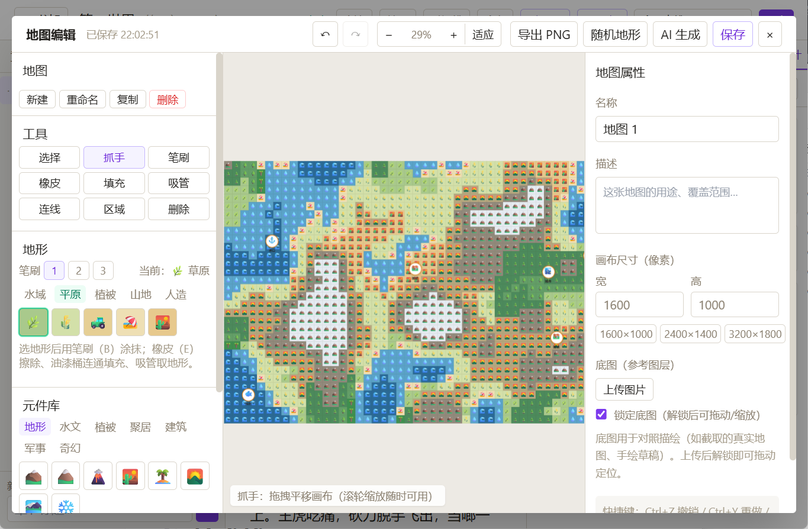

# OneFlower · 一花一世界

**AI 辅助的小说创作工作台**

一花一世界，AI助力你的想象力，快速创造属于你的世界。

[](./LICENSE)
[](https://tauri.app)
[](https://react.dev)
[](https://www.typescriptlang.org)
[](https://github.com/sleepykino/OneFlower/pulls)

[功能特性](#-功能特性) · [界面预览](#-界面预览) · [快速开始](#-快速开始) · [首次配置](#-首次配置) · [项目结构](#-项目结构) · [路线图](#-路线图)

---

> 写在最前
>
> 你才是故事的创作者，而不是AI。
>
> 当前AI写小说还有很多缺点，比如文风固定、记不住事、看不懂伏笔、剧情容易跑偏...
>
> 但优点同样出众，产出迅速，思维发散。
>
> 也许是时候仔细想一想，这些缺点未来是否能够解决，当前AI提供的灵感和想象力落地的能力是否需要。
>
> 未来如果不可挡，何不现在就加入。
>
> QQ交流群：1078337392


## 为什么是 OneFlower

- **功能齐全**：你需要的这里都有(没有欢迎找我加)
- **本地优先**：SQLite + 文件系统存储，不依赖任何云端服务，断网也能写作
- **密钥安全**：API Key 存于操作系统钥匙串，不落明文磁盘
- **模型自由**：OpenAI 兼容 / Anthropic / Google 任选，DeepSeek、智谱、Kimi 等国内服务即配即用
- **上下文透明**：每次 AI 调用注入了什么（摘要链 / 世界书 / 角色卡 / 文风），ContextPanel 一目了然

## ✨ 功能特性

### ✍️ 创作与编辑

- **富文本编辑器**（TipTap）：标题 / 引用 / 对白块、字体字号设置、全文查找替换、粘贴自动清洗
- **章节树**：多卷多章树形管理、拖拽排序、摘要状态与伏笔标记（绿点埋设 / 蓝点回收）
- **@角色 / #世界书** 节点：正文中直接引用设定，随提示词自动注入
- **版本历史**：章节级快照与差异对比，随时回滚
- **导入导出**：导入 TXT / Markdown；导出 TXT / Markdown / EPUB / DOCX（含封面、目录、页眉页脚）

### 🤖 AI 辅助（四模式）

| 模式 | 说明 |
|---|---|
| **续写** | 前情摘要链 + 近章原文 + 世界书 RAG + 角色卡自动组装上下文；可填续写要求定向引导，支持字数上限与温度调节 |
| **改写** | 选中文本 + 改写要求，流式生成替换 |
| **对白** | 场景描述 + 参与角色，生成符合人物性格的对白 |
| **检查** | 章节正文与角色卡 / 世界书设定一致性审查，输出结构化矛盾报告 |

- **流式输出**：实时渲染到编辑器临时节点，可随时中断；中断后三选项（保留 / 丢弃 / 继续补完）
- **上下文可见**：ContextPanel 展示每次调用注入的完整上下文清单与 token 占用
- **文风 Skill**：Markdown 文件定义文风指令，按模式启用、按优先级排序

### 📇 设定管理

- **角色卡**：模板可视化构建器（拖拽字段 / 实时预览 / JSON 导入导出），结构化角色数据
- **角色关系图**（React Flow）：圆形布局、拖拽节点、连线建关系、点击跳转角色卡
- **世界书 RAG**：条目自动向量化（embedding），续写时余弦检索 top-3 注入
- **伏笔追踪**：埋设 / 回收 / 弃用管理，时间线可视化，未回收过滤

### 🗺️ 世界地图

参考「易制地图」等小说地图工具打造的可视化世界构建画布（Konva 渲染）：

- **瓦片地形**：22 种地形瓦片（水域 / 平原 / 森林 / 山地 / 人文 5 大类，色块 + emoji 纹理），32px 网格自由铺设
- **自由绘制**：笔刷（B）/ 橡皮（E）/ 油漆桶（连通区域填充）/ 吸管（取地形），笔刷 3 档大小；一笔一步历史，Ctrl+Z 精细回退
- **随机生成**：分形值噪声（海拔 + 湿度双通道）生成大陆 / 岛屿生物群系，海平面、起伏度可调；一键撒聚居点（沿海自动港口渔村、内陆城镇村落）
- **AI 生成地图**：一句话描述（如"一座海滨王国，含王都、港口、北境山脉"）自动生成地点布局与道路连线
- **元件库**：60+ 图标元件（地形 / 水文 / 植被 / 聚落 / 建筑 / 军事 / 其他 7 类），点击连续放置，可关联世界书条目
- **道路与区域**：直线 / 弧线连线（实虚线、箭头、标签）；多边形区域圈选势力范围
- **画布能力**：底图上传与变换、六层图层显隐（底图 / 地形 / 区域 / 连线 / 地点 / 标注）、滚轮锚点缩放、多地图管理、导出 PNG（2x）

### 💡 灵感激发包

让"AI 辅助"从"帮你写"扩展到"帮你想"——卡文、构思、深化阶段的思考工具，不直接产出正文：

- **故事种子生成器**：输入"武侠 + 时间循环 + 复仇"式的题材与元素组合，AI 生成 5-10 个故事钩子（标题 / 一句话 logline / 3-5 句扩展 / 关键冲突 / 潜在结局）；支持语气基调（严肃 / 荒诞 / 温暖 / 黑暗）与骰子随机灵感（AI 随机搭配题材 + 元素 + 火花理由）；可收藏进灵感库，可一键建书（种子自动写入新书世界书，AI 上下文立即可用）
- **每日灵感卡片**：灵感库页顶部入口条常驻（不打断启动），点击展开获取当日一张卡片；卡片全部 AI 生成（写作技法 / 场景范例 / 人物刻画角度 / 叙事手法 / 经典开头 / 写作格言），支持 Markdown 渲染、收藏、换一张、不再推荐此类（屏蔽类型后重新生成）
- **角色采访**：编辑器内与角色卡对话——AI 扮演角色本人回答提问（注入角色卡 + 章节摘要保持人物一致性），支持六种采访角度（童年 / 动机 / 秘密 / 关系 / 事件看法 / 自由）随时切换；结束生成采访摘要预览，点「添加到角色卡」才写入设定，完整对话留档可回看、可删除
- **"如果…会怎样"推演器**：给定剧情假设（如"如果主角在第三章就死了"）+ 锚点章节 + 推演范围（后续 3/5/10 章），AI 基于摘要链 + 角色卡 + 世界书输出结构化推演报告：影响范围 / 角色弧光对比 / 剧情分支点 / 潜在风险 / AI 建议；报告可存入灵感库按书回看
- **多视角重写**：AI 面板「改写」tab 新增视角下拉——本书任一角色视角（注入角色卡保持一致性）或上帝 / 旁观者 / 未来回望视角，流式写入临时节点，保留才替换选区
- **灵感库**：全局共享的灵感仓库，种子与收藏卡片跨书籍，推演报告与采访摘要按书绑定并显示所属书籍；类型筛选 + 收藏过滤 + 关键词搜索

### 📊 写作统计

今日字数 · 目标进度 · 近 30 天趋势图 · 连续写作天数（streak）

## 📸 界面预览

### 书架首页（左侧边栏：书架 / 灵感库 / 设置）


### 写作编辑器 + AI 面板


### AI 上下文透明化


### 角色关系图


### 世界书 RAG 与伏笔追踪


### 写作统计


### 世界地图 · 随机地形生成



### 世界地图 · 手绘与标注


### 灵感库 · 今日灵感卡片


### 灵感库 · 故事种子生成器


### 角色采访


### "如果…会怎样"推演器


## 🛠️ 技术栈

| 层 | 技术 |
|---|---|
| 桌面壳 | Tauri 2（Rust） |
| 前端 | React 18 + TypeScript（严格模式）+ Vite 5 |
| 状态管理 | Zustand |
| 编辑器 | TipTap / ProseMirror |
| 关系图 | @xyflow/react |
| 地图画布 | Konva / react-konva（瓦片离屏 canvas 增量渲染） |
| 文档导出 | docx、fflate（EPUB 打包） |
| 样式 | Tailwind CSS |
| 存储 | SQLite（WAL + 单写队列）、系统钥匙串 |

## 🚀 快速开始

releases中有打包好的版本，可以直接下载使用。

### 环境要求

- Node.js >= 18
- Rust（stable 工具链）与 Tauri 2 系统依赖（见 [官方文档](https://tauri.app/start/prerequisites/)）
  - Windows：WebView2（Win10/11 自带）、MSVC Build Tools

### 命令

```bash
# 安装依赖
npm install

# 开发模式（自动拉起 Tauri 窗口与热更新）
npm run tauri dev

# 打包生产版本（产物在 src-tauri/target/release/bundle/）
npm run tauri build

# 仅做前端类型检查 / 构建
npm run typecheck
npm run build
```

## ⚙️ 首次配置

1. **添加模型**：设置页 -> Provider 管理，新建配置（类型选 OpenAI 兼容 / Anthropic / Google，填 Base URL、模型名、API Key），点击"测试连接"验证
2. **模型分工**：设置页 -> 模型分工，为各功能点（生成 / 校验 / 后台辅助 / 向量 / 灵感）绑定不同 Provider 配置；未绑定的功能点默认使用第一组配置
   - 灵感类功能（故事种子 / 灵感卡片 / 角色采访 / 假设推演）在「灵感」分组，可与正文生成分开绑定模型以控制成本
3. **向量嵌入（可选）**：设置页 -> 向量嵌入（世界书 RAG），选择支持 embeddings 的 Provider 并填嵌入模型（如 `text-embedding-3-small`）
   - Anthropic 无 embeddings 接口
   - 更换嵌入模型后，需在世界书面板重新批量向量化
4. **文风 Skill（可选）**：将 Markdown 格式的 Skill 文件放入 `~/.novelagent/skills/`，在 Skill 面板启用并设定适用模式与优先级

## 🔒 数据存储

所有数据保存在本机，不经过任何云端：

| 数据 | 位置 |
|---|---|
| 应用数据（数据库、书籍、版本快照、地图与底图） | 系统应用数据目录（Windows：`%APPDATA%\com.oneflower.novelagent`） |
| 文风 Skill | `~/.novelagent/skills/` |
| API Key | 操作系统钥匙串 |

## 📁 项目结构

```
src/
  components/    # UI 组件（编辑器、章节树、AI 面板、角色/世界书/伏笔/统计/
                 #   地图编辑器 MapEditor + MapInspector、灵感 inspiration/ 等）
  context/       # 应用上下文（服务装配）
  db/            # SQLite 初始化、迁移（schema.sql + migrations/）、单写队列
  native/        # Tauri 桥（storage/fs/db/keyStore）、对话框封装
  routes/        # 页面（首页书架 / 编辑器 / 灵感库 / 设置）
  services/      # 业务服务（AI 编排、提示词组装、摘要链、RAG、角色、关系、
                 #   章节、版本、导入导出、统计、Skill、地图、
                 #   灵感 inspiration/：种子/卡片/采访/推演/多视角重写等）
  store/         # Zustand 状态（book/editor/ai/settings）
  types/         # 共享类型定义
src-tauri/       # Rust 侧：命令、存储桥、窗口配置
doc/             # 设计文档（P0-P3 蓝图与实现规格）
docs/screenshots/# 界面截图（README 展示用）
```

## 🗺️ 路线图

- [x] **P0 - 核心**：编辑器、章节管理、AI 续写/改写/对白/检查、角色卡、世界书、版本历史、导入导出、文风 Skill
- [x] **P1 - 增强**：章节摘要链、世界书 RAG、角色关系图、上下文透明化、DOCX 导出、写作统计、伏笔时间线、模板构建器、流式继续补完
- [x] **P2 - 世界地图**：瓦片地形自由绘制（笔刷/橡皮/填充/吸管）、分形噪声随机生成 + 聚居点撒点、AI 生成地图、60+ 元件库、道路连线、区域多边形、导出 PNG
- [x] **P2.1 - 灵感激发包**：故事种子生成器（骰子随机灵感 + 一键建书）、每日灵感卡片、角色采访、"如果…会怎样"推演器、多视角重写、灵感库统一浏览
- [ ] **P3 及更多**：进行中

## 🤝 参与贡献

欢迎 Issue 与 PR：<https://github.com/sleepykino/OneFlower>

## 📄 许可

本项目基于 [Apache License 2.0](./LICENSE) 开源。

Copyright 2026 sleepykino
